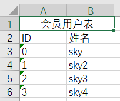

# SkyExcelHelper
项目开源 GitHub URL:
这是一个Excel表格的帮助类，也是一个ORM，可以将实体类集合转为Excel表格数据
#### 简单样例：
```c#
	//User.cs
    [ExTable("会员用户表")]
    public class User
    {
        [ExPrimaryKey]
        [ExCol("ID")]
        public int id { get; set; }
        [ExCol("姓名")]
        public string Name { get; set; }
    }
```
```c#
        static void Main(string[] args)
        {
            ExWorkbook exWorkbook = ExcelHelper.CreateWorkBook("测试");
            ExSheet<User>  UserSheet = exWorkbook.CreateSheet<User>("用户表");
            int ID = 0;
            UserSheet.Add(new User() { id = ID++, Name = "sky" })
                .Add(new User() { id = ID++, Name = "sky2" })
                .Add(new User() { id = ID++, Name = "sky3" })
                .Add(new User() { id = ID++, Name = "sky4" })
                .Submit().SaveToFile();

        }
```
#### 结果：


